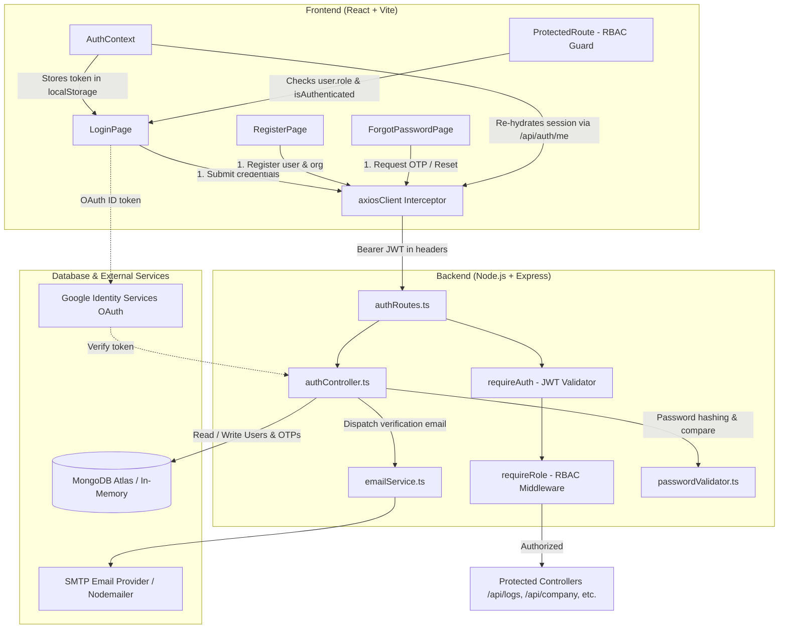
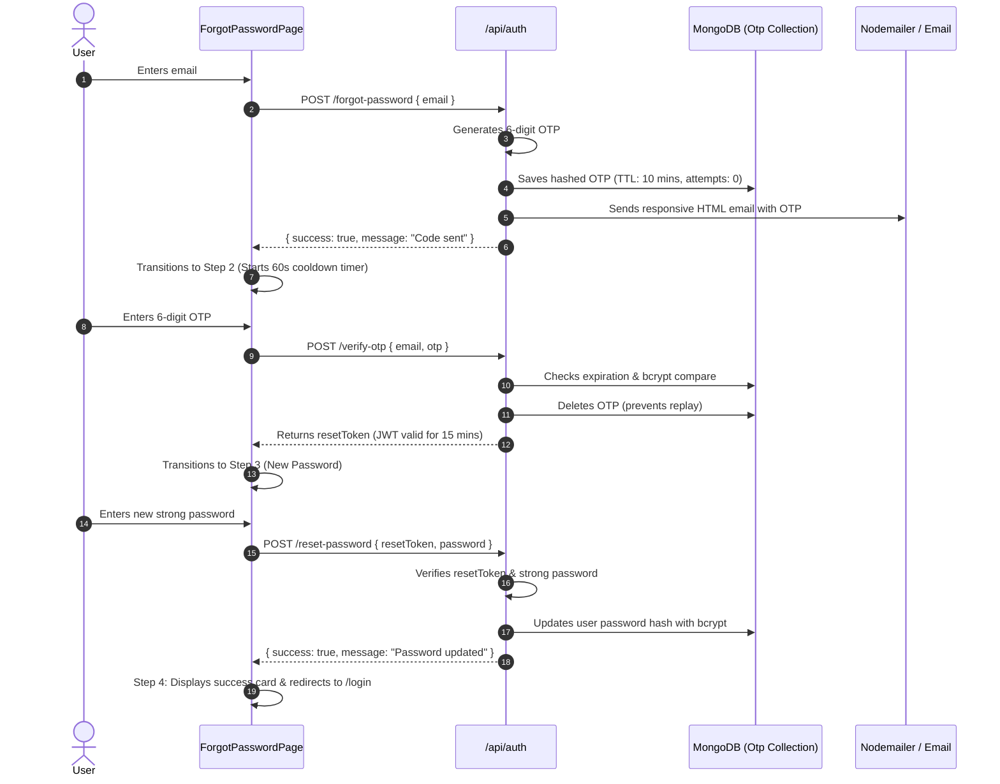

# Member 1 — Authentication & Security Documentation

**EcoTrack Corporate Sustainability Platform**  
**Role:** Member 1 — Authentication, Security & Authorization  
**Branch / Target:** `main` | Repository: [variablesmasher/ecotrack](https://github.com/variablesmasher/ecotrack)

---

## 1. Overview & Scope of Ownership

Member 1 owns the entire authentication lifecycle, cryptographic security layer, and access control system for the EcoTrack platform across both backend and frontend.

### Primary Responsibilities:
1. **User Onboarding & Registration**: Multi-tenant onboarding where a new user registers their organization, selects their country, sets a cryptographically strong password, and becomes the initial `admin`.
2. **User Login & Session Management**: Real password authentication using `bcrypt` (10 rounds) and JSON Web Tokens (`jwt.sign`) with 7-day expiration.
3. **Google OAuth 2.0 Integration**: Sign-in and sign-up with Google via Google Identity Services (GIS) on the frontend and token verification via `google-auth-library` on the backend.
4. **Forgot Password with Email OTP**: Multi-step account recovery powered by a 6-digit verification code, MongoDB TTL expiration (10 minutes), brute-force attempt limiting, and email delivery using Nodemailer.
5. **Strong Password Enforcement**: Complexity validation on both frontend (live animated meter) and backend (`[A-Z]`, `[a-z]`, `[0-9]`, symbols, minimum 8 characters).
6. **Role-Based Access Control (RBAC)**: Role validation (`admin`, `employee`, `executive`) enforced on the backend via Express middleware and on the frontend via `ProtectedRoute`.

---

## 2. Architecture & System Flow

### System Architecture Diagram



---

## 3. End-to-End Program Flows

### 3.1. Registration Flow (Organization + Admin)
1. **User Input**: The user enters their Name, Company Name, Country, Email, Password, and Confirm Password on [`src/pages/auth/RegisterPage.tsx`](file:///e:/Pratik%20Singh/Computers/Projects/ankit%20project/src/pages/auth/RegisterPage.tsx).
2. **Client-Side Validation**: `evaluatePassword()` checks that the password satisfies all 5 strength requirements (8+ chars, uppercase, lowercase, numeric, symbol). The submit button is locked if criteria are not met.
3. **HTTP Dispatch**: `apiClient.post("/auth/register", formData)` sends payload to backend.
4. **Backend Processing** ([`server/controllers/authController.ts`](file:///e:/Pratik%20Singh/Computers/Projects/ankit%20project/server/controllers/authController.ts)):
   - Re-validates strong password rules using `validateStrongPassword()`.
   - Checks MongoDB for an existing user with the same email.
   - Creates a new `Company` document in MongoDB.
   - Hashes password using `bcrypt.hash(password, 10)`.
   - Creates a new `User` document with `role: "admin"` linked to `company._id`.
   - Generates a signed JWT (`signToken`) with payload `{ id, role: "admin", companyId }`.
5. **Session Initiation**: The frontend stores `{ token, user, companyName }` in `localStorage` and redirects to `/onboarding`.

### 3.2. Login Flow (Standard Email + Password)
1. User enters email and password on [`src/pages/auth/LoginPage.tsx`](file:///e:/Pratik%20Singh/Computers/Projects/ankit%20project/src/pages/auth/LoginPage.tsx).
2. Backend queries MongoDB with `.select("+password")` to explicitly retrieve the hashed password.
3. Backend runs `bcrypt.compare(password, user.password)`. If invalid, returns `401 Unauthorized`.
4. On success, returns signed JWT and user info. Frontend stores session in `localStorage` and redirects to `/dashboard`.

### 3.3. Google OAuth 2.0 Sign-In / Sign-Up Flow
1. User clicks **"Continue with Google"** on Login or Register page via [`src/components/auth/GoogleSignInButton.tsx`](file:///e:/Pratik%20Singh/Computers/Projects/ankit%20project/src/components/auth/GoogleSignInButton.tsx).
2. Google Identity Services displays the Google account chooser and returns a signed ID token credential.
3. Frontend calls `googleLogin(credential)` &rarr; `POST /api/auth/google`.
4. Backend verifies token with `OAuth2Client.verifyIdToken({ idToken, audience })`:
   - Extracts email, name, avatar picture, and Google sub ID.
   - If user exists: links Google ID/avatar and signs session JWT.
   - If user does not exist: auto-creates an Organization (`"<Name>'s Organization"`) and creates an Admin User with `googleId`, then signs session JWT.
5. *Dev Mode Fallback*: If `GOOGLE_CLIENT_ID` is not configured in development, clicking Google displays a mock account modal for 1-click local testing.

### 3.4. Forgot Password & Email OTP Flow (4 Steps)



---

## 4. Role-Based Access Control (RBAC) Architecture

EcoTrack features three distinct user roles:

| Role | Scope | Permissions |
| :--- | :--- | :--- |
| **`admin`** | Organization Admin | Full access: Manage Company Profile, Departments, Users, Carbon Logs, Analytics, and Reports. |
| **`employee`** | Operational Staff | Can log carbon activities, view logs, and perform CSV bulk uploads for their department. Blocked from user management and company settings. |
| **`executive`** | Stakeholder / C-Suite | View-only access: Executive Analytics, Trend Charts, and Sustainability Reports. Blocked from manual log creation and user management. |

### Backend RBAC Implementation
Enforced by combining `requireAuth` and `requireRole`:
```typescript
// server/routes/logRoutes.ts
const canManageLogs = requireRole(["admin", "employee"]);
router.post("/", requireAuth, canManageLogs, createLog);

// server/routes/userRoutes.ts
router.get("/", requireAuth, requireRole(["admin"]), getUsers);
```

### Frontend RBAC Implementation
Enforced by [`ProtectedRoute`](file:///e:/Pratik%20Singh/Computers/Projects/ankit%20project/src/App.tsx#L97-L108):
```tsx
// src/App.tsx
<Route path="users" element={
  <ProtectedRoute allowedRoles={["admin"]}>
    <UsersPage />
  </ProtectedRoute>
} />
```
If an `employee` attempts to navigate directly to `/dashboard/users`, `ProtectedRoute` intercepts the request and redirects them to `/dashboard`.

---

## 5. File-by-File Technical Reference

### Backend Files

#### 1. [`server/middleware/auth.ts`](file:///e:/Pratik%20Singh/Computers/Projects/ankit%20project/server/middleware/auth.ts)
- Extracts `Bearer <token>` from HTTP `Authorization` header.
- Verifies signature against `process.env.JWT_SECRET`.
- Injects decoded payload `{ id, role, companyId }` into Express `req.user`.

#### 2. [`server/middleware/requireRole.ts`](file:///e:/Pratik%20Singh/Computers/Projects/ankit%20project/server/middleware/requireRole.ts)
- Higher-order Express middleware taking `allowedRoles: string[]`.
- Returns `403 Forbidden` if `req.user.role` is not permitted.

#### 3. [`server/controllers/authController.ts`](file:///e:/Pratik%20Singh/Computers/Projects/ankit%20project/server/controllers/authController.ts)
- Contains all authentication business logic: `register`, `login`, `googleLogin`, `getMe`, `forgotPassword`, `verifyOtp`, `resetPassword`.

#### 4. [`server/models/User.ts`](file:///e:/Pratik%20Singh/Computers/Projects/ankit%20project/server/models/User.ts)
- Mongoose schema with `email` (unique, lowercase), `password` (hashed, `select: false`), `role`, `companyId`, `googleId` (sparse index), and `avatar`.

#### 5. [`server/models/Otp.ts`](file:///e:/Pratik%20Singh/Computers/Projects/ankit%20project/server/models/Otp.ts)
- Model for storing password reset verification codes.
- Features a MongoDB TTL index: `{ expiresAt: { type: Date, index: { expires: 0 } } }` for automatic document deletion upon expiration.
- Tracks `attempts` counter to prevent brute force attacks (locks out after 5 failures).

#### 6. [`server/utils/emailService.ts`](file:///e:/Pratik%20Singh/Computers/Projects/ankit%20project/server/utils/emailService.ts)
- Configures Nodemailer transport using environment variables (`SMTP_HOST`, `SMTP_PORT`, `SMTP_USER`, `SMTP_PASS`).
- Formats and sends a responsive HTML email with the 6-digit OTP.
- Includes terminal logging banner for rapid local testing without external email credentials.

#### 7. [`server/utils/passwordValidator.ts`](file:///e:/Pratik%20Singh/Computers/Projects/ankit%20project/server/utils/passwordValidator.ts)
- Server-side regex validator for strong passwords.

---

### Frontend Files

#### 1. [`src/context/AuthContext.tsx`](file:///e:/Pratik%20Singh/Computers/Projects/ankit%20project/src/context/AuthContext.tsx)
- Central authentication React context.
- Maintains `isAuthenticated`, `userName`, `role`, `companyName`, `token`, and `avatar`.
- On initial mount, reads `localStorage` and calls `GET /api/auth/me` to re-validate the token against the backend.

#### 2. [`src/pages/auth/LoginPage.tsx`](file:///e:/Pratik%20Singh/Computers/Projects/ankit%20project/src/pages/auth/LoginPage.tsx)
- Login view with email/password form, password visibility toggle, demo credentials accordion, and Google Sign-In button.

#### 3. [`src/pages/auth/RegisterPage.tsx`](file:///e:/Pratik%20Singh/Computers/Projects/ankit%20project/src/pages/auth/RegisterPage.tsx)
- Organization signup view.
- Integrates Google Sign-Up and real-time `PasswordStrengthMeter`.
- Enforces strong password completion before allowing form submission.

#### 4. [`src/pages/auth/ForgotPasswordPage.tsx`](file:///e:/Pratik%20Singh/Computers/Projects/ankit%20project/src/pages/auth/ForgotPasswordPage.tsx)
- 4-step recovery wizard with individual digit auto-advancing inputs, paste support, 60s countdown resend timer, and password reset form.

#### 5. [`src/components/auth/PasswordStrengthMeter.tsx`](file:///e:/Pratik%20Singh/Computers/Projects/ankit%20project/src/components/auth/PasswordStrengthMeter.tsx)
- Interactive visual component displaying an animated 4-segment strength bar and 5 requirement badges with checkmarks.

#### 6. [`src/components/auth/GoogleSignInButton.tsx`](file:///e:/Pratik%20Singh/Computers/Projects/ankit%20project/src/components/auth/GoogleSignInButton.tsx)
- Google-branded sign-in button using Google Identity Services (GIS) and local dev simulation modal.

#### 7. [`src/App.tsx`](file:///e:/Pratik%20Singh/Computers/Projects/ankit%20project/src/App.tsx)
- Top-level routing configuration.
- Contains `ProtectedRoute` for client-side authentication and role-based redirects.

---

## 6. Security Features & Best Practices

1. **Password Hashing**: Passwords are never stored in plaintext. Always hashed with `bcryptjs` with a work factor of 10 rounds.
2. **Password Leak Prevention**: `password` is set to `select: false` in the Mongoose `User` schema so user queries elsewhere in the app never return the password hash.
3. **Information Enumeration Protection**: `forgot-password` always returns a generic success response even if the email does not exist, preventing attackers from harvesting valid emails.
4. **Replay Attack Protection**: Verification OTPs are deleted from MongoDB immediately upon first successful verification.
5. **Token Security**: Session JWTs are signed with a server-side `JWT_SECRET` and expire in 7 days. Password reset tokens expire in 15 minutes and have `purpose: "password-reset"`.
6. **Rate Limiting & Brute Force Defense**: OTP records track `attempts`. After 5 incorrect entries, the OTP is deleted and the user is locked out from further attempts.

---

## 7. Verification & Build Integrity

- **TypeScript Compilation**: `npx tsc --noEmit` runs with **0 errors**.
- **Production Build**: `npm run build` succeeds cleanly, bundling the Vite client and Node server into [`dist/`](file:///e:/Pratik%20Singh/Computers/Projects/ankit%20project/dist).
- **Deployment Ready**: Fully configured for Render with [render.yaml](file:///e:/Pratik%20Singh/Computers/Projects/ankit%20project/render.yaml).
